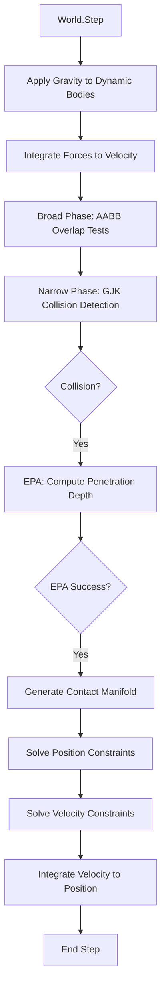
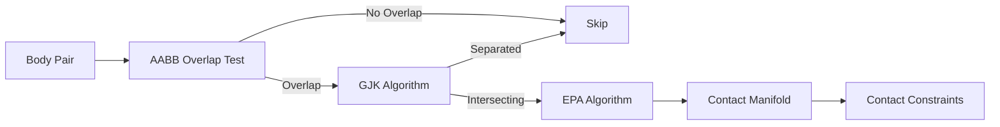
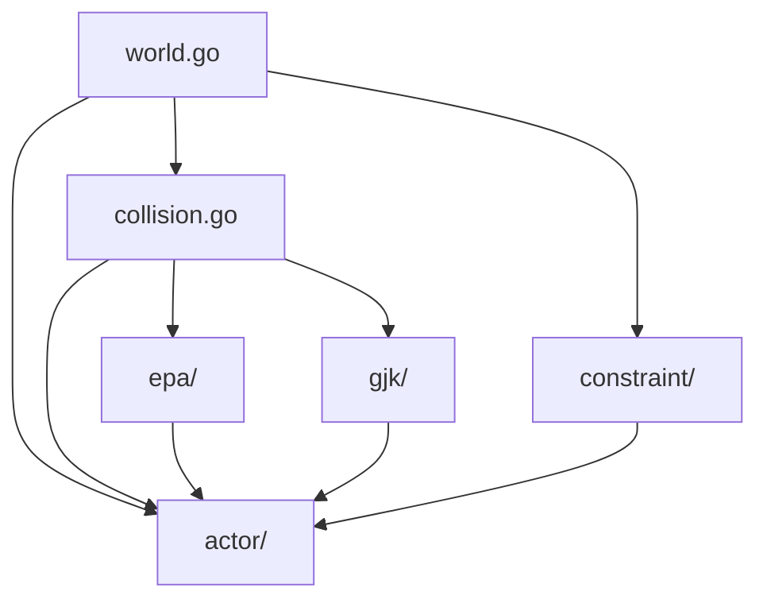

# Feather Physics Engine - Architecture & Design Decisions

This document explains the architectural choices, design decisions, and rationale behind the Feather physics engine implementation.

## Table of Contents

1. [Architecture Overview](#architecture-overview)
2. [XPBD Solver Choice](#xpbd-solver-choice)
3. [Collision Detection Pipeline](#collision-detection-pipeline)
4. [Shape System Design](#shape-system-design)
5. [Current Limitations](#current-limitations)
6. [Architecture Diagrams](#architecture-diagrams)

---

## Architecture Overview

Feather is built on a modular architecture with clear separation of concerns:

```
┌─────────────────────────────────────────────────────────────┐
│                         World                                │
│  - Manages all rigid bodies                                  │
│  - Orchestrates physics pipeline                             │
│  - Applies global forces (gravity)                           │
└─────────────────────────────────────────────────────────────┘
                          │
                          ▼
┌─────────────────────────────────────────────────────────────┐
│                    Physics Step                              │
│  1. Apply Forces → Integrate to Velocity                     │
│  2. Broad Phase Collision Detection (AABB)                   │
│  3. Narrow Phase Collision Detection (GJK + EPA)             │
│  4. Generate Contact Manifolds                               │
│  5. Solve Position Constraints                               │
│  6. Solve Velocity Constraints (Restitution)                 │
│  7. Integrate Velocity → Position                            │
└─────────────────────────────────────────────────────────────┘
```

### Design Philosophy

1. **Modularity**: Each component (collision detection, constraint solving, integration) is isolated
2. **Extensibility**: Interface-based design allows easy addition of new shapes and constraints
3. **Performance**: Conscious trade-offs between accuracy and speed for real-time game applications
4. **Simplicity**: Prioritize clear, maintainable code over premature optimization

### Package Structure

```
feather/
├── world.go, collision.go     # Core physics pipeline
├── actor/                     # Physical objects
│   ├── rigidbody.go          # Dynamic/static bodies
│   ├── shape.go              # Shape interface & implementations
│   ├── transform.go          # Spatial transforms
│   └── aabb.go               # Bounding volumes
├── constraint/               # Constraint solving
│   ├── constraint.go         # Constraint interface
│   └── contact.go            # Contact constraint solver
├── gjk/                      # GJK collision algorithm
├── epa/                      # EPA penetration depth
│   ├── epa.go               # Main EPA algorithm
│   ├── manifold.go          # Contact point generation
│   └── face.go              # Polytope face management
└── example/simpleScene/      # Usage examples
```

---

## XPBD Solver Choice

### Why XPBD (Extended Position-Based Dynamics)?

We chose XPBD over alternative physics solvers for several compelling reasons:

#### 1. **Superior Stability for Stacking**
- XPBD handles resting contacts and stacked objects much better than impulse-based methods
- Position-based constraints prevent the "jitter" and "explosion" issues common in penalty methods
- Critical for games with towers, buildings, or piles of objects

#### 2. **Compliance-Based Soft Constraints**
- Compliance parameter provides intuitive control over constraint "stiffness"
- More physically meaningful than arbitrary penalty coefficients
- Allows for realistic soft bodies and deformable objects in the future

#### 3. **Timestep Independence**
- XPBD behavior remains consistent across different timesteps (within reason)
- Unlike basic PBD which is timestep-dependent
- Important for variable framerates in games

#### 4. **Convergence Guarantees**
- Mathematical guarantees of convergence to correct solution
- More predictable behavior than iterative impulse solvers

### Alternatives Considered

#### Sequential Impulse Solver (Box2D/Bullet Style)
- **Pros**: Fast, well-understood, widely used
- **Cons**:
  - Less stable for large stacks
  - Requires careful parameter tuning
  - Timestep-dependent behavior
- **Why not chosen**: Stability was our primary concern

#### Penalty-Based Methods
- **Pros**: Simple to implement, fast computation
- **Cons**:
  - Very difficult to tune (spring constants are unintuitive)
  - Prone to explosions with high stiffness
  - Requires very small timesteps for stability
- **Why not chosen**: Poor stability and difficult parameterization

#### Projected Gauss-Seidel (PGS)
- **Pros**: Industry standard, robust
- **Cons**:
  - More complex implementation
  - Requires warm-starting for good performance
  - Similar to what we get with XPBD anyway
- **Why not chosen**: XPBD provides similar benefits with simpler implementation

### Academic References

- **Original XPBD Paper**: "XPBD: Position-Based Simulation of Compliant Constrained Dynamics" by Macklin et al. (2016)
- **PBD Foundation**: "Position Based Dynamics" by Müller et al. (2007)
- **Comparison Study**: "Detailed Rigid Body Simulation with Extended Position Based Dynamics" by Macklin et al. (2020)

---

## Collision Detection Pipeline

Our collision detection uses a classic two-phase approach: broad phase filtering followed by narrow phase precise detection.

### Broad Phase: Simple AABB Overlap Testing

**Current Implementation**: O(n²) brute-force AABB overlap checks

**Why this approach?**
- **Simplicity**: Easy to implement and debug
- **Small-scale focus**: Perfectly acceptable for <100 bodies
- **No false negatives**: Guaranteed to find all potential collisions
- **Minimal memory overhead**: No spatial data structures to maintain

**Future Plans**:
- Spatial grid / hash for medium-scale scenes (100-1000 bodies)
- Bounding Volume Hierarchy (BVH) for large-scale scenes (1000+ bodies)
- The architecture supports drop-in replacement when needed

### Narrow Phase: GJK + EPA

**GJK (Gilbert-Johnson-Keerthi) Algorithm**

**Why GJK?**
- **Versatility**: Works for ANY convex shape (boxes, spheres, capsules, polyhedra, etc.)
- **Speed**: Converges very quickly (typically 3-6 iterations)
- **Simplicity**: Core algorithm is ~100 lines of code
- **Extensibility**: Adding new shapes only requires implementing a support function

**Alternative Considered: SAT (Separating Axis Theorem)**
- **Pros**: Slightly faster for boxes, provides penetration depth directly
- **Cons**:
  - Shape-specific code for each pair (box-box, sphere-box, etc.)
  - Doesn't generalize to smooth shapes (spheres, capsules)
  - Much more code to maintain
- **Why not chosen**: GJK's generality is worth the minor performance cost

**EPA (Expanding Polytope Algorithm)**

**Why EPA after GJK?**
- GJK only tells us IF shapes overlap, not HOW MUCH
- EPA computes precise penetration depth and contact normal
- Builds on GJK's final simplex (no wasted work)
- Essential for realistic contact resolution

**Key Implementation Details**:
- Handles degenerate cases (coplanar faces, polytope collapse)
- Maximum iteration limit prevents infinite loops
- Convergence tolerance balances precision vs performance
- Returns error on failure (graceful degradation)

### Manifold Generation: Sutherland-Hodgman Clipping

**Why Multi-Point Contacts?**
- **Stability**: Multiple contact points prevent excessive rotation
- **Realism**: Large flat surfaces (box on ground) should have area contact, not point contact
- **Torque**: Proper torque calculation requires knowing contact distribution

**Algorithm Choice: Sutherland-Hodgman**
- Classic polygon clipping algorithm
- Generates 1-4 contact points (reduced from potential 8+ for performance)
- Well-tested, robust implementation

**Special Cases**:
- **Sphere-Sphere**: Single contact point at midpoint (analytical solution)
- **Sphere-Box/Plane**: Project sphere center onto closest feature
- **Plane contacts**: Project box corners onto plane

---

## Shape System Design

### Interface-Based Polymorphism

The shape system uses Go interfaces for clean polymorphism:

```go
type ShapeInterface interface {
    GetType() ShapeType
    ComputeAABB(transform Transform) AABB
    ComputeMass(density float64) (mass float64, inertia mgl64.Mat3)
    Support(direction mgl64.Vec3) mgl64.Vec3
}
```

**Design Benefits**:
1. **Extensibility**: Adding new shapes requires only implementing the interface
2. **Type Safety**: Compile-time checking of shape requirements
3. **Performance**: Interface calls are fast in Go (static dispatch where possible)
4. **Testability**: Easy to mock shapes for testing

### Shape Implementations

#### Box (Oriented Bounding Box)
- **Representation**: Half-extents (width/2, height/2, depth/2)
- **Rotation**: Full quaternion support for arbitrary orientation
- **Mass Properties**: Analytical formulas for mass and inertia tensor
- **Use Cases**: Buildings, crates, walls, platforms

#### Sphere
- **Representation**: Radius
- **Rotation**: N/A (spherically symmetric)
- **Mass Properties**: I = (2/5) * m * r²
- **Use Cases**: Balls, projectiles, simplified characters

#### Plane
- **Representation**: Normal vector + distance from origin
- **Rotation**: Normal defines orientation
- **Mass Properties**: Infinite mass (static only)
- **Special Handling**: Infinite shape requires custom collision logic
- **Use Cases**: Ground, walls, infinite surfaces

### Future Shapes (Planned)

- **Capsule**: Cylinder with hemispherical caps (great for characters)
- **Cylinder**: For wheels, pillars
- **Convex Hull**: General polyhedra from point clouds
- **Compound Shapes**: Combine multiple shapes into one body

### Support Function: Core of GJK

The `Support()` function is critical for GJK algorithm:

```go
// Returns the farthest point in the given direction
Support(direction Vec3) Vec3
```

**Why this design?**
- GJK only needs to query extreme points, not full geometry
- Allows implicit shapes (no vertex/edge storage needed)
- Analytical computation is often faster than searching vertices
- Natural abstraction for convex shapes

---

## Current Limitations

Understanding current limitations helps set appropriate expectations and guides future development.

### 1. Transform: Position-Only (No Rotation)

**Current State**: `Transform` type only handles translation

**Why?**
- **Phased Development**: Getting core physics working first
- **Simplification**: Easier debugging without rotational dynamics
- **Incremental Complexity**: Will add rotation once contacts are stable

**Impact**:
- Boxes cannot rotate (orientation locked)
- No angular velocity or torque
- Simplified inertia tensor calculations

**Timeline**: Next major feature to implement

### 2. Friction: Not Implemented

**Current State**: No friction forces applied at contacts

**Why?**
- **Core First**: Collision detection and basic response take priority
- **Algorithm Selection**: Still evaluating friction models (Coulomb vs others)
- **Complexity**: Friction requires tangent space calculations and additional solver passes

**Impact**:
- Objects slide unrealistically on surfaces
- No resistance to lateral motion
- Spinning objects don't slow down

**Timeline**: Phase 2 development (after rotation)

### 3. Single-Threaded Execution

**Current State**: All physics runs on one thread

**Why?**
- **Simplicity**: Multi-threading adds significant complexity
- **Correctness First**: Get sequential version correct first
- **Profiling Needed**: Need to identify actual bottlenecks before parallelizing

**Future Plans**:
- Goroutines for independent body integration
- Parallel broad-phase AABB tests
- Island-based parallel constraint solving

**Acceptable For**: <100 bodies at 60 FPS

### 4. No Spatial Acceleration

**Current State**: O(n²) brute-force broad phase

**Impact**: Performance degrades quadratically with body count

**Acceptable For**: Small to medium scenes (<100 bodies)

**Future**: Spatial grid or BVH when needed

### 5. No Sleep/Deactivation System

**Current State**: All bodies updated every frame

**Impact**: Wasted computation on resting objects

**Future**: Island detection and sleep state for stable bodies

---

## Architecture Diagrams

### Complete Physics Pipeline Flow



### Collision Detection Flow



### Package Dependencies



### Data Flow in World.Step()

```
Input: dt (N substeps)
│
├─► For each dynamic body:
│   └─► Apply gravity: F = m * g
│
├─► For each dynamic body:
│   └─► Integrate: v += (F/m) * dt
│
├─► Broad Phase:
│   ├─► Compute AABB for each body
│   └─► Find overlapping pairs O(n²)
│
├─► Narrow Phase:
│   ├─► For each pair:
│   │   ├─► GJK: Check collision
│   │   ├─► EPA: Compute depth & normal
│   │   └─► Manifold: Generate contact points
│   └─► Output: List of contacts
│
├─► Position Solver (XPBD - once per substep):
│   └─► For each contact:
│       └─► Apply position correction (XPBD)
│
├─► Velocity Solver (XPBD - once per substep):
│   └─► For each contact:
│       └─► Apply velocity correction (restitution)
│
└─► For each body:
    └─► Integrate: x += v * dt

Output: Updated body positions and velocities
```

---

## Design Patterns Used

### 1. **Strategy Pattern**: Shape Interface
- Different collision strategies for different shapes
- Swap implementations without changing client code

### 2. **Iterator Pattern**: Body Management
- World iterates over bodies for force application, integration
- Decouples physics algorithms from storage

### 3. **Factory Pattern**: Shape Creation
- Centralized shape construction (future)
- Ensures proper initialization

---

## Performance Characteristics

### Computational Complexity

| Component | Complexity | Notes |
|-----------|-----------|-------|
| Broad Phase | O(n²) | Will improve with spatial grid |
| Narrow Phase (GJK) | O(1) per pair | ~3-6 iterations typical |
| EPA | O(1) per collision | ~5-15 iterations typical |
| Manifold | O(1) per collision | Max 4 contact points |
| Position Solver | O(c * s) | c contacts, s substeps (1 pass/substep) |
| Velocity Solver | O(c * s) | c contacts, s substeps (1 pass/substep) |

### Memory Usage

- **Per Body**: ~200 bytes (transform, velocity, shape reference)
- **Per Contact**: ~150 bytes (points, normal, penetration depth)
- **Spatial Data**: None currently (will add spatial grid)

### Typical Performance

- **Small scenes** (<50 bodies): 1-2ms per frame at 60 FPS
- **Medium scenes** (50-100 bodies): 5-10ms per frame
- **Large scenes** (>100 bodies): Needs spatial acceleration

---

## Future Architecture Enhancements

### Short-Term
1. ✅ Rotation support (Transform quaternions)
2. ✅ Friction implementation
3. ✅ Sleep/island detection
4. ✅ Spatial grid for broad phase

### Medium-Term
1. Additional shapes (capsule, cylinder, convex hull)
2. Distance constraints (springs, ropes)
3. Trigger volumes (non-physical overlap detection)
4. Joint constraints (hinge, slider, ball-socket)

### Long-Term
1. Multi-threading with goroutines
2. Soft body dynamics (cloth, deformables)
3. Fluid simulation integration

---

## Conclusion

Feather's architecture prioritizes:
- **Clarity** over cleverness
- **Correctness** over optimization (initially)
- **Extensibility** for future features
- **Real-time performance** for game applications

The XPBD solver, GJK+EPA collision detection, and interface-based shape system provide a solid foundation for a modern physics engine while maintaining code simplicity and maintainability.

For detailed algorithm explanations, see [ALGORITHMS.md](ALGORITHMS.md).
For practical usage and parameter tuning, see [PHYSICS_GUIDE.md](PHYSICS_GUIDE.md).
